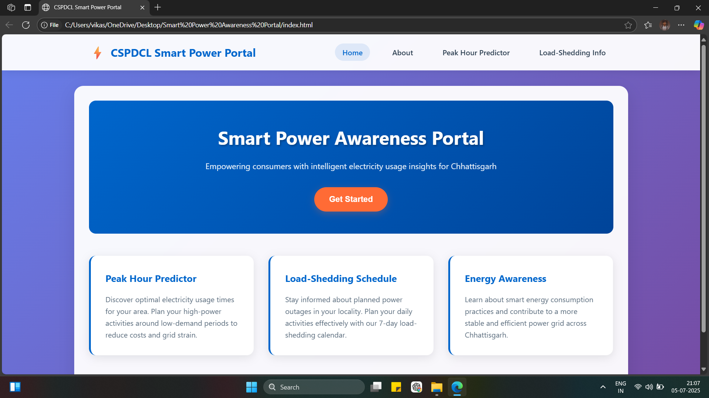
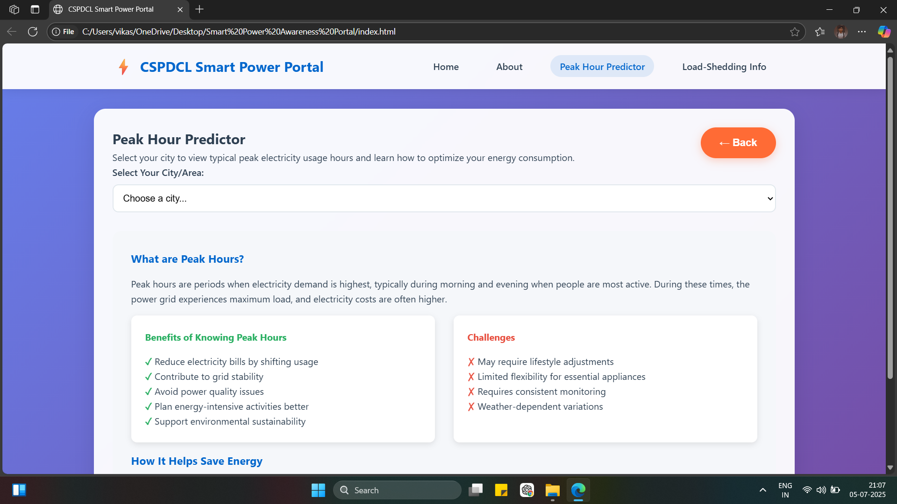

# ⚡ Smart-Power-Awareness-Protal

A user-friendly web application that helps citizens of Chhattisgarh easily view **peak electricity usage hours** and **load-shedding schedules** across different cities, areas, and feeders.

---

## 🌟 Features

- 🔎 View **real-time-like 7-day load-shedding schedule** by city, area, and feeder
- 📊 Get **peak hour insights** to plan electricity usage efficiently
- ☎️ Contact information of **AE (Assistant Engineer)** and **JE (Junior Engineer)** for each region
- 🌐 Fully responsive design — accessible on mobile and desktop
- ⚙️ Built with **HTML**, **CSS**, **JavaScript**, and **structured JSON**

---

## 🧠 Project Use Case

Helps **citizens** stay informed about power outages and peak consumption times, enabling better planning and awareness of local electricity distribution.

---
## 🏗️ Project Structure
<Pre>
   
smart-load-dashboard/
├── index.html
├── css/
│ └── style.css
├── js/
│ └── script.js
└── assets/
</Pre>
----
## 🧪 Sample Workflow

1. 👤 User selects:
   - City → Area → Feeder
2. 📆 The schedule for the selected feeder is displayed
3. ⚡ Peak hours and AE/JE contacts are shown
4. ✅ Users can plan electricity usage around outage timings

---

## 💡 Future Enhancements

- ✅ Integrate live data from CSPDCL API (if available)
- 🌍 Add map-based visual load indicators
- 🔔 Push notification for scheduled outages

---

## 👨‍💻 Developed By

**Vikash Kushwaha**  
B.Tech CSE | Data Science Focus  
Passionate about building real-world utilities using clean code and good UI

---

## 📷 Screenshots

> 
>
---

## 📄 License

MIT License – Feel free to use and modify
